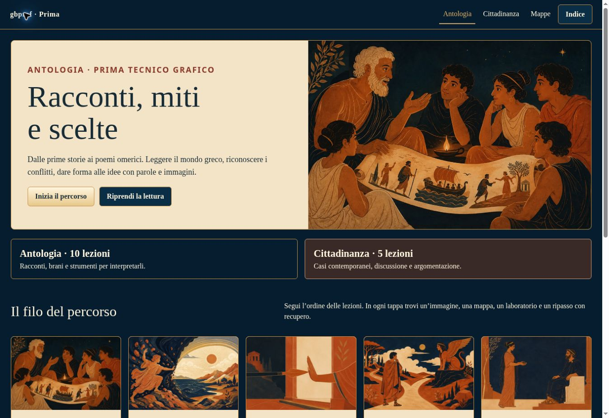

# Antologia · Prima tecnico grafico

PWA didattica statica gbprof: 10 lezioni di Antologia e 5 di Cittadinanza, 15 illustrazioni originali, 16 mappe SVG+PNG, 75 quesiti e 75 recuperi. Interfaccia ispirata al modello Foscolo del repository IV-anno: blu, carta e oro; lettura, Osserva, Appunti, Ripassa.

Aprire `index.html` attraverso un server HTTP locale oppure da un sito HTTPS. Percorso previsto sul server: `/I-anno/antologia/`. Il push del repository non configura automaticamente quel server.



## Indice

| Antologia | Cittadinanza |
|---|---|
|[01 · Che cos’è il racconto?](lezioni/01-racconto.html)|[C1 · Comunicare: quale storia mostri?](lezioni/c1-comunicare.html)|
|[02 · Mito e cosmogonia](lezioni/02-mito.html)|[C2 · Giudicare con informazioni](lezioni/c2-giudicare.html)|
|[03 · Hybris, nemesi e limite](lezioni/03-limite.html)|[C3 · Legge, dignità e dissenso](lezioni/c3-dissentire.html)|
|[04 · Edipo](lezioni/04-edipo.html)|[C4 · Affrontare il conflitto](lezioni/c4-conflitto.html)|
|[05 · Antigone](lezioni/05-antigone.html)|[C5 · Ospitalità e identità](lezioni/c5-identita.html)|
|[06 · Paride e la guerra di Troia](lezioni/06-paride.html)||
|[07 · La scelta di Achille](lezioni/07-achille.html)||
|[08 · L’Iliade in breve](lezioni/08-iliade.html)||
|[09 · L’Odissea in breve](lezioni/09-odissea.html)||
|[10 · Raccontare e scegliere](lezioni/10-raccontare.html)||

## Studio

Appunti, evidenziazioni, tentativi e progressi sono locali, separati dalle altre PWA. Non servono account o chiavi API. Il taccuino si esporta come testo. La ricerca attraversa tutte le lezioni. Le due aree dialogano mediante ponti con ritorno alla posizione di lettura.

Tutti i contenuti principali vengono scaricati al primo accesso. I collegamenti alle fonti esterne richiedono internet. La cache usa una versione derivata dai file e uno spazio specifico per il percorso. Un aggiornamento viene proposto allo studente, conserva gli appunti e rimuove solo le vecchie cache di questa PWA.

## Struttura e risorse prodotte

- `index.html`, `cittadinanza.html`: indici distinti.
- `lezioni/<id>.html`:15 lezioni autosufficienti.
- `contenuti/<id>.json`: fonti redazionali complete.
- `assets/images/<id>.webp`: una illustrazione per ognuno dei 15 ID dell’indice, 1200×800. [Elenco e impronte](docs/immagini.json); [prompt](docs/prompts-illustrazioni.json).
- `assets/mappe/<id>.svg` e `.png`: una mappa per ognuno dei 15 ID, più `00-percorso`,1440×1120. [Galleria](mappe.html).
- `assets/app.js`, `assets/style.css`, `assets/catalog.js`: ambiente di studio e ricerca.
- `manifest.webmanifest`, `sw.js`, `assets/icons`: installazione, aggiornamenti e offline.
- `guida.html`, `docente.html`, `docs/`: istruzioni, provenienza e collaudi.

Le immagini sono interpretazioni didattiche contemporanee, non fotografie di reperti. Le mappe sono SVG impaginati con testi e relazioni esatti e rasterizzati in PNG.

## Rigenerare e verificare

Il sito distribuito non richiede una build o dipendenze. Per lo sviluppo locale basta Node 22 o successivo:

```sh
npm run dev
```

Dopo modifiche ai JSON, usare Python 3.10+ con Pillow; per riesportare i PNG serve anche il pacchetto Node `sharp` (dipendenza solo redazionale):

```sh
python tools/build.py
node tools/package-assets.mjs
python tools/cache.py
npm run check
```

`tools/build.py` rigenera lezioni, indici, galleria, SVG, catalogo, icone e manifest. `tools/cache.py` va eseguito dopo l’ultima modifica a una risorsa distribuita. Il dev server serve sia la cartella alla radice sia `/I-anno/antologia/`, per verificare i percorsi. La rotta `/__qa` esiste soltanto nel server di sviluppo e mostra viewport tablet per il collaudo; non fa parte della PWA statica.

## Documentazione

- [Inventario delle 16 fonti](docs/inventario-fonti.md).
- [Correzioni e limiti documentali](docs/nota-docente.md).
- [Matrice delle funzioni](docs/matrice-funzioni.md).
- [Risultati di collaudo e prova sul dispositivo reale](docs/collaudo.md).
- [Guida docente](docente.html).

Il controllo in Chromium e nelle dimensioni tablet non equivale a un test su Safari iPad reale. La nota docente dichiara separatamente il limite del controllo visivo degli originali Drive.
